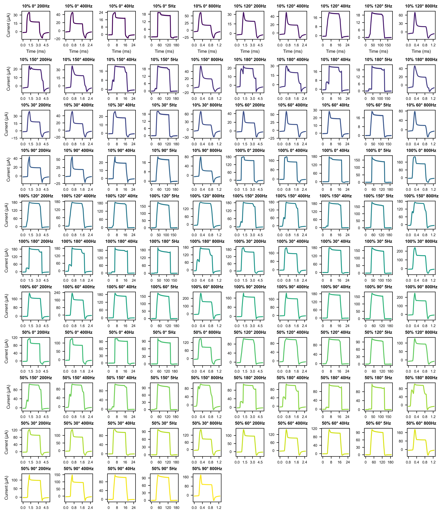
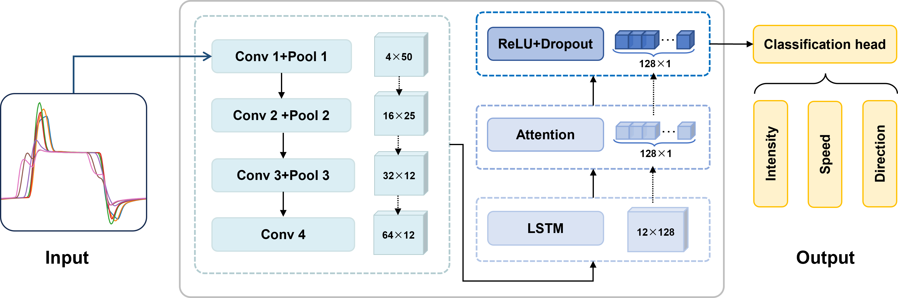
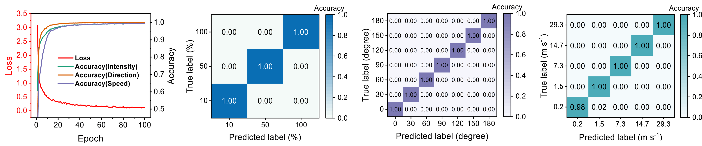

# In-Sensor Waveform Encoding for Motion Perception via Structural Engineering of Asymmetric Perovskite Photodetectors

## Abstract

Reliable motion perception from visual signals is essential for intelligent systems, but conventional optical-flow methods often degrade under changing illumination or occlusion. Here we present an in-sensor encoding strategy that extracts motion information directly from photodetectors. By inserting a high dielectric constant aluminum oxide (Al2O3) layer, polarization behavior is coupled with carrier dynamics, and the asymmetric pixel design further enhances directional sensitivity. The devices encode light intensity, motion speed, and direction in the photocurrent waveforms without extra optical or electrical components. With machine-learning algorithms, the device achieves consistently high recognition accuracy over a broad speed range (0.2-30 m s-1), angular span (0-180°) and light intensity range (8.4-84.2 mW cm-2). We demonstrate real-time human–machine interaction by converting photocurrent signals generated by finger motion into commands for a block-stacking game. A 5 × 5 array and large-array simulations confirmed scalable motion estimation under dynamic illumination and occlusion. This work provides a robust hardware foundation for compact visual motion sensors

## Photocurrent data

The photocurrent response of the device under varying light intensity, motion direction, and speed.

## network

The model consists of four convolutional layers with pooling (Conv 1–Conv 4), followed by an LSTM and an attention mechanism for temporal feature extraction. A ReLU with Dropout layer and a classification head are applied to generate outputs corresponding to light intensity, motion speed, and direction.

## Performance

## Environment

Python >= 3.8, PyTorch >= 1.8, NumPy >= 1.20, pandas >= 1.3, Matplotlib >= 3.4, and PyWavelets >= 1.1 are required.
